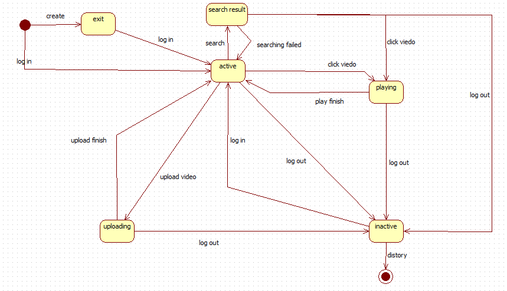

##            网络视频播放器内容建模分析报告 
&emsp;根据网络视频播放系统的需求分析模型，包括该系统的用例图与活动图。可以得到该系统的各个功能性模块以及他们所能实现的服务，而活动图表现出了系统的整体运作流程。因此，内容建模旨在将各个功能模块以及其所能实现的功能在系统的总体框架中体现并实现出来，将从需求工程中决定的Web应用信息和功能需求转换为模型，并用静态的类图与动态的状态图加以体现。  
####1.内容建模中的静态建模  
​        静态建模即构建网络视频播放器的基础类图，并展现系统中最为基础的类以及他们之间相互的继承，聚合以及依赖关系。是对需求分析结果的初步构想与实现，网络视频播放系统的基础类图如下：

基础类图由普通账户（User），管理员账户（Administrator），上传中心（UpLoadCenter），发布中心（ReleaseCenter）,视频（Video），资源（Resource），以及待审资源（TryVideo）六大类构成，Resource类与TryVideo类继承自Video类，代表两种不同的视频资源。普通用户可对资源以及自己的上传中心进行点击观看和上传管理等操作，却不具备对待审资源的操作能力，管理员账户除去拥有普通账户的功能外，可以对发布中心进行管理，实现上传资源的审核与发布，而且可以对已发布的资源执行下架操作。普通账户和管理员账户都具备登录登出等功能，而普通账户可以被注销，管理员账户将一直存在。

#### 1.内容建模中的动态建模

​        动态建模即构建系统状态图，即各个对象在其生命周期内的状态变化，转移以及造成状态转移的事件。体现了系统中各个对象从创建到消亡的全部变化。状态图如下：

上图为普通用户的状态图。

上图为管理员账户的状态图。

上图为视频资源的生命周期状态图。

普通用户与管理员共同拥有视频资源的浏览，上传，播放，搜索功能，而管理员用户还拥有待审资源的发布与下架资源的权限。而视频资源仅拥有播放，下架，待审三种状态。